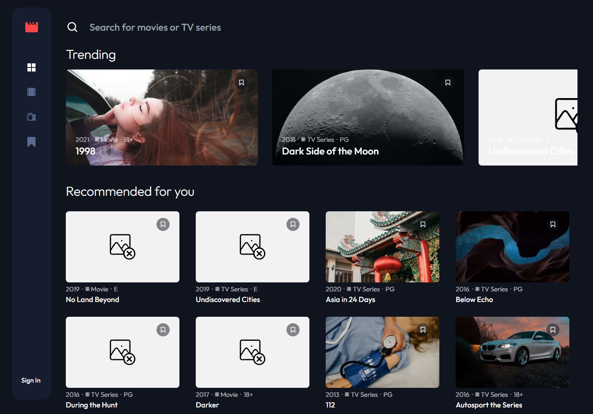

# Frontend Mentor - Entertainment web app solution

This is a solution to the [Entertainment web app challenge on Frontend Mentor](https://www.frontendmentor.io/challenges/entertainment-web-app-J-UhgAW1X).

## Table of contents

- [Overview](#overview)
  - [Features](#the-challenge)
  - [Screenshot](#screenshot)
  - [Link to live version](#links)
- [My process](#my-process)
  - [Built with](#built-with)
  - [Goals](#what-i-learned)
  - [Continued development](#continued-development)

## Overview

### Features

- Connected to a data base on firebase
- Possiblity to log in and sing in
- Possibility for logged users to add movies to Favorites
- Possibility to add user thumbnail
- Serach bar (used downshift.js)
- "Recommended for you" on the main page - every time you refresh it draws different videos
- Favorites page only for logged users
- Videos thumbnails are progressively loaded (used react-progressive-graceful-image)

### Screenshot

### Link to live version

- Live Site URL: [Live site URL](https://entertainment-web-app-87503.web.app)

## My process

### Built with

- HTML5 markup
- TailwindCSS
- [React](https://reactjs.org/) - JS library
- Firebase
- Mobile-first workflow
- Atomic design methodology

### Goals

While developing the project, I wanted to learn about and practice styling elements using TailwindCSS. Also, I emphasized the use of Atomic design methodology

### Continued development

In the future I would definitely like to work on optimizing the application, did a little refactoring and look for improvements.

From the functionality I would like to add the ability to delete previously saved favorite videos
To do:

Przerobić że ładuje się nawigacja po prawej a potem reszta elementów
poprawić ulubione
dodać usuwanie
